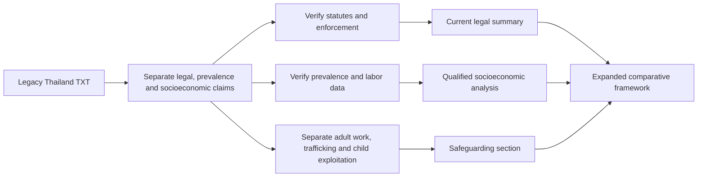

# Thailand Sex-Work, Tourism and Trafficking Analysis

**Scope:** Refactored English version of the legacy Spanish plaintext note `La inclusión de Tailandia.txt`.

> **Editorial status.** This document preserves the analytical themes of the legacy source while separating inherited legal, prevalence and socioeconomic claims from verified facts. All legal classifications, population estimates, historical interpretations and trafficking claims require current authoritative validation before publication or operational use.

## 1. Purpose and comparative context

The Thailand case extends the existing comparative framework covering the Philippines, Türkiye, Mexico, India and Israel. It is included as a distinct Southeast Asian case because the legacy note describes a formal prohibition framework coexisting with a large entertainment economy, tourism-related demand, informal labor and regional migration.

The analysis should avoid reducing Thailand to a tourism or sex-work stereotype. National law, local enforcement, entertainment-sector regulation, public-health policy, labor conditions, migration and anti-trafficking enforcement must be considered separately.

## 2. Legal and regulatory framework

The legacy source cites Thailand's **Prevention and Suppression of Prostitution Act (1996)** as a central statute and characterizes prostitution-related activity as prohibited while describing broad de facto tolerance within parts of the entertainment economy.

Before external use, verify:

1. the current text and scope of the 1996 Act and related criminal provisions;
2. licensing and labor rules affecting entertainment venues, massage businesses and nightlife establishments;
3. current police and municipal enforcement practices;
4. any active legislative proposals concerning decriminalization or labor-rights reform;
5. public-health protections and access to services; and
6. the legal separation between consensual adult sex work, trafficking, coercion and child sexual exploitation.

## 3. Scale and prevalence estimates

The source gives a broad estimate of approximately **150,000 to 300,000** people involved in sex work in Thailand. This figure is retained only as a **legacy estimate**.

It must not be presented as a current national count without an identifiable source, year, population definition and methodology. Hidden populations, informal work, differing definitions and inconsistent geographic coverage can produce substantial variation between studies.

## 4. Urban and tourism context

The legacy note identifies Bangkok, Pattaya, Phuket and Chiang Mai as important urban or tourism case studies. These locations can be useful for comparative analysis, but they should not be treated as representative of Thailand as a whole.

A rigorous treatment should distinguish:

- national law from city-level implementation;
- tourism districts from residential and rural labor markets;
- entertainment work from sexual services;
- domestic demand from international tourism; and
- lawful migration and hospitality employment from trafficking or coercion.

## 5. Regional migration and trafficking vulnerability

The source describes Thailand as a country of origin, transit and destination within regional migration and trafficking systems and references neighboring countries such as Myanmar, Laos and Cambodia.

Any current analysis should separate voluntary adult migration from trafficking. Recruitment, debt, document retention, threats, confinement and deception are relevant indicators of coercion, while nationality or migration status alone must never be treated as evidence of trafficking or sex work.

## 6. Socioeconomic context

The legacy source associates participation in informal sex work with structural factors including:

- household debt and rural income inequality;
- limited formal employment opportunities;
- internal migration;
- remittance expectations;
- gendered family responsibilities; and
- tourism-driven regional labor markets.

These factors should be analyzed at population level. They must not be used to infer the conduct of a particular woman, worker, migrant or resident.

## 7. Child-protection separation

Any involvement of a person under 18 in commercial sexual exploitation must be analyzed under a **child-protection and exploitation framework**, not as adult sex work.

This document therefore defers child-specific analysis to [`child-commercial-sexual-exploitation-global-analysis.md`](./child-commercial-sexual-exploitation-global-analysis.md), including tourism-associated exploitation, online exploitation, trafficking and safeguarding obligations.

## 8. Comparative integration

| Jurisdiction | Legacy analytical emphasis | Verification focus |
| --- | --- | --- |
| Philippines | Prohibition framework, informal sector and tourism-related risk claims | Current criminal law, local enforcement, trafficking and tourism evidence |
| Thailand | Formal prohibition alongside a large entertainment economy and tourism-related exposure | Current law, enforcement, labor conditions, reform proposals, migration and trafficking data |
| India | Private adult activity distinguished from prohibited surrounding conduct | ITPA, criminal code, Supreme Court directives and state implementation |
| Türkiye | State-regulated licensed system alongside informal activity | Licensing, municipal implementation and worker protections |
| Mexico | Federal/local regulatory fragmentation | Federal, state and municipal law; public-order and trafficking distinctions |
| Israel | Demand-side prohibition model | Current statute, enforcement data, social-support policy and prevalence methodology |

This matrix is descriptive and does not rank legal systems or jurisdictions.

## 9. Evidence-quality checklist

A publication-ready Thailand analysis should verify:

- current statutes and implementing regulations;
- current reform proposals, if any;
- official or peer-reviewed prevalence estimates;
- city-specific studies rather than national extrapolation from tourism districts;
- labor and migration data;
- trafficking statistics that do not conflate consensual adult work with exploitation;
- public-health and worker-safety evidence; and
- child-protection indicators kept separate from adult sex-work analysis.

## 10. Research workflow

## 11. Editorial safeguards

- The discussion of sex work concerns consenting adults only.
- Child sexual exploitation is a separate child-protection category.
- Tourism, nationality, poverty, migration status, occupation or location must not be used to profile individuals.
- Trafficking must not be conflated with consensual adult sex work.
- Historical prevalence figures remain unverified until linked to identifiable datasets and methods.
- The document provides research and policy analysis, not guidance for locating, purchasing or arranging sexual services.
