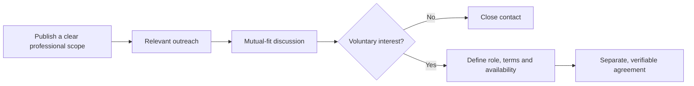

# Conversion, Collaboration and Income Analysis for Ukraine

> **Editorial status:** migrated from plaintext. Income figures and conversion percentages in the original document are unvalidated hypotheses or estimates and must not be presented as observed LinkedIn, OkCupid or Ukrainian-market metrics.

## 1. Professional context

The original document characterizes Ukraine's technology and professional-services sector as resilient and strongly exposed to international clients. It also highlights the importance of volunteering and projects related to reconstruction, rural development and social assistance.

### Sectors considered

- Software Engineering.
- Project Management.
- NGOs and civil society.
- AgTech.
- Renewable energy.
- Regional development.

## 2. LinkedIn as a professional channel

The text proposes LinkedIn for:

- technical collaboration;
- institutional alliances;
- skills-based volunteering;
- investment or co-funding outreach.

Interest and conversion percentages included in the original file should be treated as **planning assumptions**, not platform benchmarks.

### Recommended flow

## 3. OkCupid and usage boundaries

The original document discusses OkCupid as a social-affinity platform. That purpose should remain separate from recruiting, investment, commercial prospecting or volunteering.

A `match` does not imply:

- professional interest;
- willingness to invest;
- willingness to relocate;
- acceptance of cohabitation;
- consent to a relationship or specific activity.

A dating platform should not be used to bypass professional or commercial prospecting restrictions.

## 4. Corrected conceptual matrix

| Dimension | LinkedIn | OkCupid |
| --- | --- | --- |
| Primary purpose | Professional | Social / relationship-oriented |
| Appropriate project use | Collaboration, employment, volunteering or clearly described partnerships | Interpersonal connection consistent with platform rules |
| Investment | Only through an explicit and legally appropriate professional proposal | Should not be solicited as part of a dating interaction |
| Metrics | Measure with actual project data | Do not turn personal affinity into a commercial KPI |

## 5. Verification requirements

Before reusing economic or market figures:

1. Update salaries and macroeconomic indicators using recent official or sector sources.
2. Document sample size and observation period if project-specific conversion rates are calculated.
3. Keep investment, volunteering, paid work and personal relationships in separate processes.
4. Apply appropriate safeguards for war, displacement and economic vulnerability.
