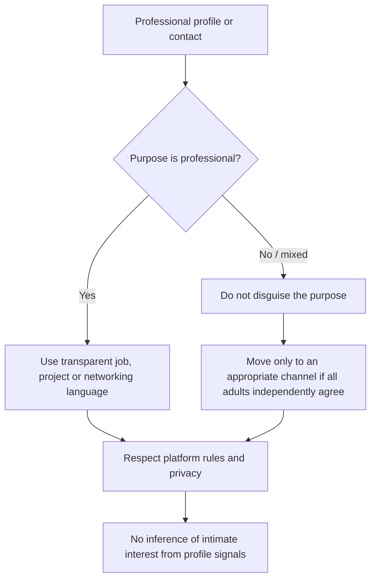

# University Sex-Work Estimates and Platform Integrity

> **Editorial status:** translated and refactored from a Spanish plaintext note. The inherited prevalence ranges are unverified and should be treated as research hypotheses until checked against current, identifiable sources.

## 1. Latin American prevalence estimates

The source argues that quantitative research on university sex work in Latin America is affected by substantial underreporting because of stigma, limited campus-level surveys and fear of administrative or social consequences.

It cites an indirect estimate of **2–4%** of active university communities participating or having participated in some form of sex-economic exchange. This figure must not be presented as a regional fact without source validation, because:

- definitions differ across studies;
- many surveys are convenience samples;
- universities and countries are not interchangeable populations;
- participation, consideration and online-content creation are often measured separately.

## 2. Activity categories described in the legacy source

The original note groups activity into three broad categories:

| Category | Legacy share | Editorial treatment |
| --- | ---: | --- |
| Digital content and camming | 50–60% | Unverified; may overlap with other categories |
| Compensated dating / sponsorship | 30–35% | Unverified; definitions vary substantially |
| In-person / indoor services | 10–15% | Unverified; likely subject to strong underreporting |

These percentages should be interpreted only as claims from the source material, not as validated market shares.

## 3. Platform-integrity issue

The legacy text also describes attempts to use coded language on professional networks to disguise sexual or compensated-arrangement solicitation. That material has been **refactored rather than reproduced operationally**.

Professional platforms such as LinkedIn should be used according to their current terms of service. A professional profile should not be used to conceal prohibited sexual-service advertising, evade moderation or target people based on assumed willingness to enter compensated intimate arrangements.

### 3.1 Safer analytical framing

Instead of documenting evasion vocabulary, platform research should focus on:

- how moderation policies define prohibited solicitation;
- how false or misleading professional identities can expose users to fraud or coercion;
- how platforms can distinguish legitimate hospitality, concierge, protocol or travel roles from prohibited solicitation without profiling individuals;
- reporting, appeal and safety mechanisms;
- migration to appropriate channels when a conversation is no longer professional.

## 4. Professional-profile safeguards

Recommended safeguards:

1. do not infer sexual, romantic or compensated-dating interest from occupation, photos, travel history, luxury settings or networking language;
2. do not use euphemisms or hidden codes to bypass moderation;
3. keep recruitment, investment, dating and sexual-service contexts separate;
4. use explicit, revocable consent before moving a conversation into a different context;
5. preserve evidence for fraud, extortion or coercion reporting where appropriate.

## 5. Research-quality requirements

A future evidence-based study should document:

- sampling frame and sample size;
- country and institution;
- age threshold and adult-only inclusion criteria;
- definitions of sex work, compensated dating and online content;
- whether percentages are mutually exclusive;
- survey date and confidence intervals where available;
- ethics review and participant-protection procedures.

## 6. Boundary between consensual activity and exploitation

Consensual adult sex work, compensated dating, trafficking, coercion and sexual exploitation are not interchangeable categories. Research and institutional policy should preserve those distinctions and provide dedicated referral pathways for anyone experiencing coercion, violence, blackmail or trafficking.
